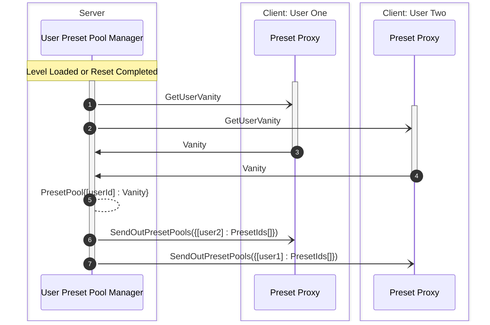
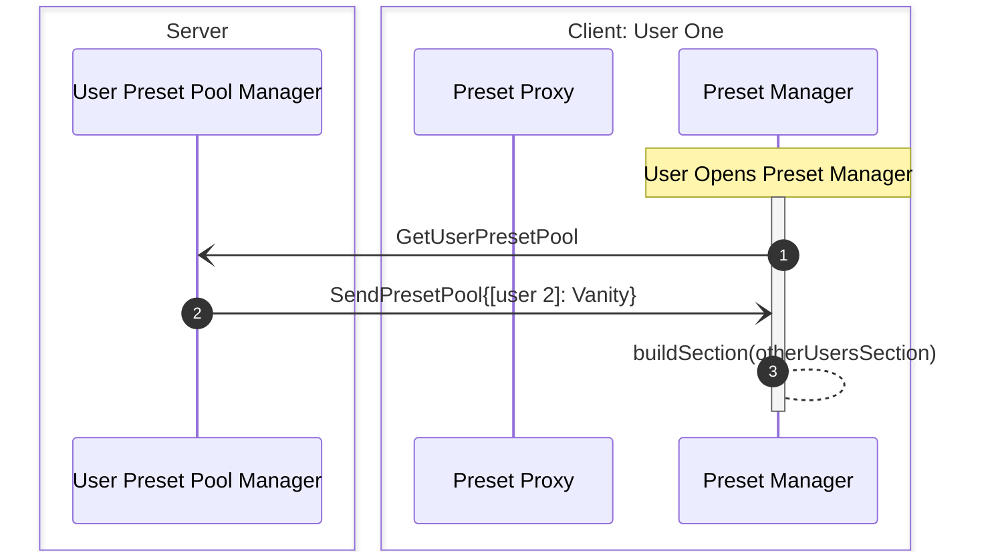
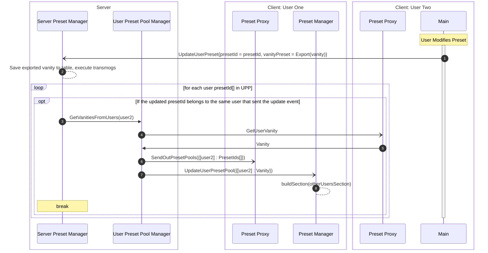
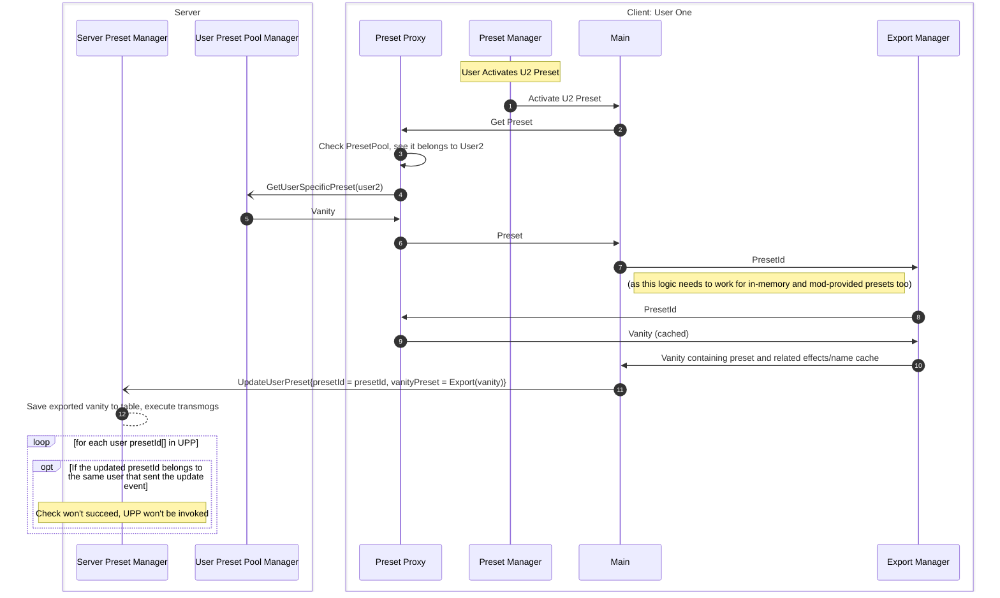

# The Armory

## Preset Flowchart

| NetChannel       | Description                                      | Client Usage                          | Server Usage                          |
|------------------|--------------------------------------------------|---------------------------------------|---------------------------------------|
| GetUserVanity    | Requests vanity data for a specific user         | Sends request to server               | Responds with vanity data             |
| SendOutPresetPools | Sends preset pool data to clients               | Receives updated preset pool data     | Broadcasts preset pool data to clients |
| GetUserPresetPool | Requests the preset pool for a specific user     | Sends request to server               | Responds with preset pool data        |
| UpdateUserPreset | Updates the server with a modified user preset   | Sends updated preset to server        | Saves updated preset and executes changes |

### Initialization

### Opening Preset Manager

### User 2 Modifies Active Preset

### User 1 Activates User 2's Preset

